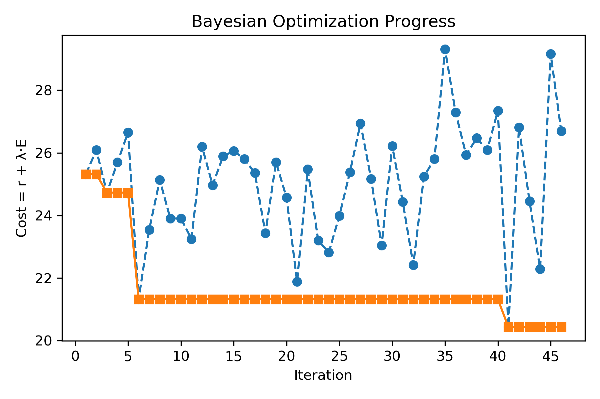

# Communication and Energy-Aware Multi-UAV Coverage Path Planning

This repository implements a distributed multi-UAV coverage path planning system for networked operations based on our paper:

**"Decentralized Communication and Energy-Aware Multi-UAV Coverage Path Planning"**  
Felix Muller and Nick Truttmann  
ETH Zurich, 2025

---


---

## Overview

This project addresses the challenge of deploying multiple UAVs to efficiently cover an area while maintaining network connectivity and minimizing energy consumption. We implement a novel approach combining:

1. **Distributed centroid Voronoi partitioning**: Divides the workspace evenly among UAVs while accounting for their relative capabilities
2. **Spanning Tree Coverage (STC)**: Generates efficient coverage paths within each partition
3. **Communication Radius estimation**: Uses GHS algorithm to create a minimum spanning tree (MST) to estimate the required communication range. 
4. **Bayesian Optimization**: Optimizes starting positions and seeds to minimize both energy consumption and communication radius

The system is implemented as a distributed multi-agent ROS2 application where each UAV operates independently while maintaining network connectivity.

## Key Components


## Results

Our approach achieves:
- Balanced area assignment among homogenous UAVs
- Complete coverage with minimal path overlap
- Optimized energy efficiency 
- Scalability to multiple UAVs



## Usage

Launch the system with four UAVs:
```bash 
ros2 run controller controller
```


Monitoring and cleanup:
```bash
ros2 node list

killall -9 uav_agent
```

## Implementation Details

Each agent uses multiple mixins:
- `PartitionMixin`: Implements distributed power diagram partitioning
- `STCMixin`: Implements Spanning Tree Coverage algorithm
- `RadiusMixin`: Handles communication radius calculations
- `EnergyMixin`: Computes energy consumption for paths
