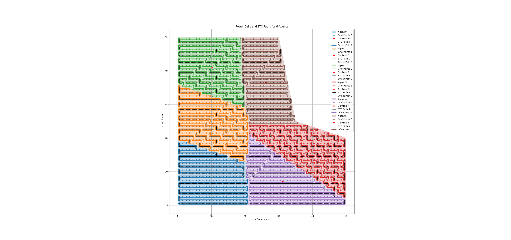

# Distributed Multi-UAV Coverage Path Planning

This repository implements a distributed multi-UAV coverage path planning system based on:

**"Communication and Energy-Aware Multi-UAV Coverage Path Planning for Networked Operations"**  
Mohamed Samshad and Ketan Rajawat  
[arXiv:2411.02772](https://arxiv.org/pdf/2411.02772)

---



---


## Features

- Distributed area decomposition
- Spanning Tree Coverage (STC) for each UAV
- Smooth offset path generation (to be done)
- Full workspace coverage with minimal overlap

---

## Usage
```bash 
ros2 run controller controller
```

or 

```bash
ros2 launch launch/quad_uav.py
```

It is possible, that sometimes with faulty exits, some nodes survive. You can check using

```bash
ros2 node list
```

and kill them all using 

```bash
killall -9 uav_agent  
```
